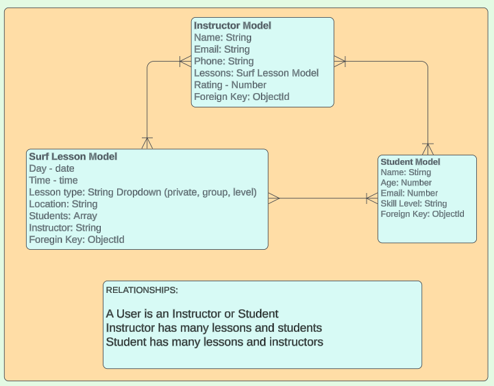
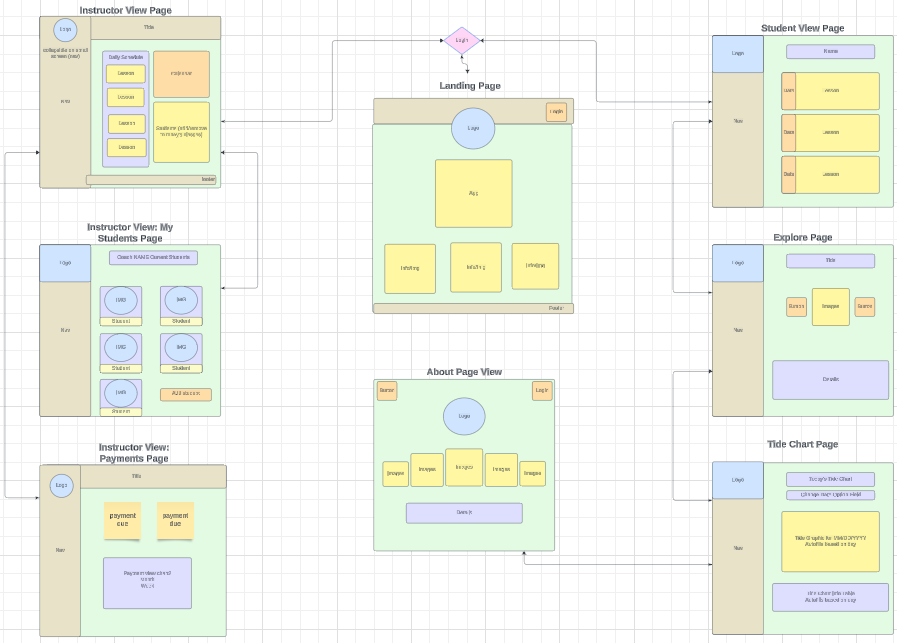

# <h1 align="center">SURF BUDDY</h1>
 #### <h3 align="center">Heroku link coming soon...</h3>
 
 <h4 align="center">SwellDevs</h4>      
 
 

  
  
  
    
 
 

## 📝Description
Do you love to surf but don't know how and finding instructors is tough?  Well, look no further!  The SwellDevs invite you to the newest technology making waves in the surfing industry: SurfBuddy! Browse lessons and instructors to learn to surf or freshen up on your skills.  Lessons will show you their skill levels and the surf instructors rating.  Hope to catch you dropping in on the Surf Buddy App!

## 🖼️ Screenshots

 
 📊 ERD

 
 | Description | Screenshot |
 |------------ | ------------|
 | <h3 align="center">ERD</h3> | 
 

 
 🎨 Wireframes

 
 | Description | Screenshot |
 |------------ | ------------|
 | <h3 align="center">Wireframes</h3> | 
 
 

 
 ⚙️ Functionality

 
 | Description | Screenshot |
 |------------ | ------------|
 | <h3 align="center">Feed Page</h3> | 
 

 

 
## 💻 Technologies Used

 

## ⚛️ Getting Started
### 📲 Instructions

How to Find a Surf Lesson

 
1. Navigate to the nav bar on the top of the screen or left side of the screen.
 
2. Click "View All Lessons".
 
3. Scroll through the list of lessons and click "Details" to view more details about that lesson.

How to Find an Instructor

 
1. Navigate to the nav bar on the top of the screen or left side of the screen.
 
2. Click "View All Instructors".
 
3. Scroll through the list of instructors and click "Details" to view more details about that instructor.

How to View a Tide Chart

 
1. Navigate to the nav bar on the top of the screen or left side of the screen.
 
2. Click "Tide Chart".
 
3. View the tide level, locations, date, and times for the tides.

### 🔗 Links

Trello Board

<a href="https://trello.com/b/iCp81rsC/project-3-django-surf-school-management-app">https://trello.com/b/iCp81rsC/project-3-django-surf-school-management-app</a>

Deployed Link (Heroku)

<a href="">Coming soon...</a>

Pitch Deck

<a href="https://docs.google.com/presentation/d/12URHWm5WDc87J-wb8UHS7l1GAjFj3zIdtLII1ReKNng/edit?usp=sharing">https://docs.google.com/presentation/d/12URHWm5WDc87J-wb8UHS7l1GAjFj3zIdtLII1ReKNng/edit?usp=sharing</a>

## ⏭️ Next Steps
- [ ] Find and fix bugs
- [ ] Refactor Code

